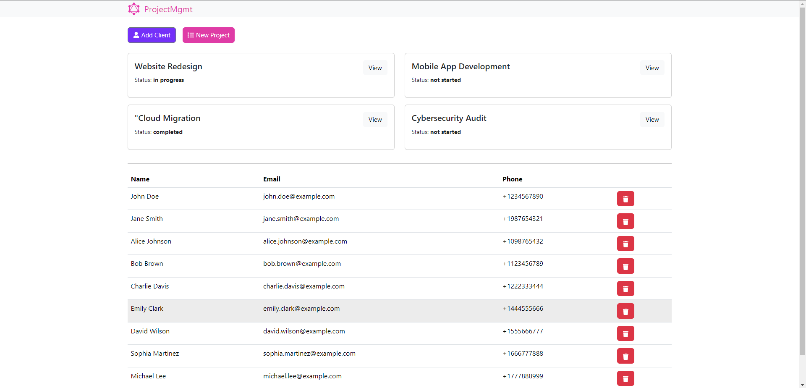
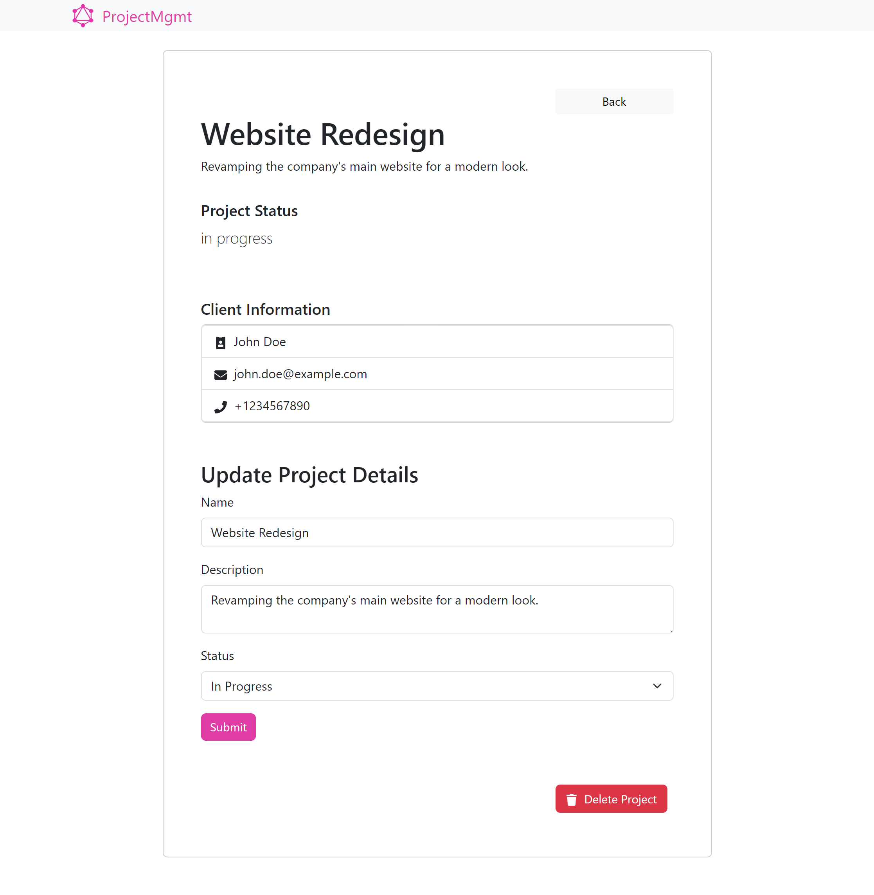

# CRUD GraphQL Simple Project
<div align="center">
  
  
</div>

## Overview

The CRUD GraphQL Simple Project is a basic implementation of a GraphQL API that allows clients to perform CRUD operations on a specific data model projects. It serves as a starting point for building more complex GraphQL projects.

## Installation

To install and run the project, follow these steps:

1. Clone the repository: `https://github.com/ahmed-226 Graphql-CRUD-.git`
2. Navigate to the client directory: `cd client`
3. Install dependencies: `npm install`
4. Start the server: `npm start`
5. Navigate to the server directory: `cd Server`
6. Install dependencies: `npm install`
7. Start the server: `npm start`

## Usage

Once the server is running, you can access the GraphQL API using a tool like [GraphQL Playground](https://www.graphqlbin.com/v2/new). The API provides the following operations:

- `create`: Create a new client/project data model.
- `read`: Retrieve an client/project data model.
- `update`: Update an existing client/project data model.
- `delete`: Delete an client/project data model.

## Examples

Here are some examples of how to use the GraphQL API:

- To create a new item:
```
mutation {
    addProject(
        name: "New Item",
        description: "This is a new item"
        status:new
    ) {
        id
        name
        description
    }
}
```

- To retrieve an item:
```
query {
    projects(id: "123") {
        id
        name
        description
    }
}
```

- To update an item:
```
mutation {
    updateProject(
        id: "123", 
        name: "Updated Item",
        description: "This item has been updated"
    ) {
        id
        name
        description
    }
}
```

- To delete an item:
```
mutation {
    deleteProject(id: "123") {
        id
        name
        description
    }
}
```

## Contributing

Contributions are welcome! If you have any suggestions or improvements, please submit a pull request.

## License

This project is licensed under the [MIT License](https://opensource.org/licenses/MIT).
